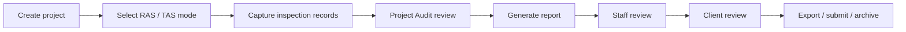

# Convert to RAS

**Status:** Planning / architecture note (not an implementation spec)  
**Last updated:** 2026-06-01  
**Audience:** Product owner, architecture review, implementation planning

> **Disclaimer:** This document captures internal planning for adapting FREDAsoft toward Registered Accessibility Specialist (RAS) workflows under the Texas Department of Licensing and Regulation (TDLR). It does **not** assert legal compliance, required forms, or final field lists. All TDLR/RAS requirements must be verified from official sources, sample deliverables, and qualified review before any implementation.

---

## 1. Purpose

FREDAsoft today supports accessibility inspection and reporting workflows used by consultants and inspectors: organizing work by project and facility, capturing structured deficiency records, attaching findings/recommendations/standards/photos/costs, and producing printable/PDF-style reports plus an internal Web Report Viewer.

This document records considerations for **adapting or extending** FREDAsoft so it can better support inspections performed as **Registered Accessibility Specialists (RAS)** under **TDLR** expectations in Texas. The goal is to align product thinking, data model options, reporting shape, and phased delivery—**without** committing to code, schema, or compliance claims in this phase.

---

## 2. Background

RAS-related accessibility work in Texas is tied to state licensing and compliance-oriented inspection/reporting practices. Inspectors operating in that context typically need:

- Traceable **project and registration** context (who, what building, which regulatory frame).
- Consistent **terminology and standards** (often Texas Accessibility Standards — TAS — and related federal references where applicable).
- **Structured findings** that can be reviewed, corrected, and re-inspected.
- **Reports** that may need specific sections, certification language, signatures, dates, and photo/citation treatment.
- Eventually, **submission, retention, and audit** expectations (forms, exports, possibly electronic filing—TBD).

FREDAsoft already models much of the *mechanics* of inspection documentation (records, locations, citations, photos, costs, reports). What is **not** yet defined in product terms is how RAS/TDLR-specific metadata, report templates, workflows, and validation rules should layer on top—or whether RAS should be a distinct **mode**, **project type**, or **product variant**.

This is **future planning**. Nothing in this document should be read as approved scope for the next sprint.

---

## 3. Current FREDAsoft capabilities relevant to RAS

The following existing areas are likely **carry-forward assets** when evaluating RAS support. They are not guaranteed to map 1:1 to TDLR deliverables without requirement review.

| Area | Relevance to RAS planning |
|------|---------------------------|
| **Project / facility / location organization** | Core structure for multi-building work, scoped narratives, and per-location deficiencies. |
| **Data Entry (`projectData` records)** | Primary capture surface for deficiencies; snapshot fields preserve report-time text. |
| **Glossary sets (e.g. TAS 2012, UFAS)** | Standardized category/item/finding/recommendation templates; TAS may dominate RAS work. |
| **Findings and recommendations** | Master libraries + per-record snapshots; grouping and audit tooling exist. |
| **Standards / citations** | Record-level and glossary-linked citations; referenced-standards addendum in reports. |
| **Photos** | Per-record image arrays; documentation cards use first images; supplemental photos in addendum. |
| **Costs / financial section** | Optional remediation costing; may or may not be required for all RAS deliverables. |
| **Web Report Viewer** | Read-only web rendering with filters, session state, Financial / Referenced Standards / Photo Addendum sections. |
| **PDF / Report Preview** | Sectioned printable report with sort order, addenda, and section availability rules. |
| **Project Audit** | Internal QA across project records (warnings, report-content filters, snapshot drift). |
| **Future client-facing web report + auth** | Planned direction for published/read-only client views; relevant for owner review and staff roles. |

**Implication:** RAS conversion may be an **extension and template layer** more than a greenfield product—provided TDLR requirements fit the existing record/report model after research.

---

## 4. Likely RAS-specific requirements to investigate

The list below is a **research backlog**, not a specification. Each item needs confirmation against TDLR rules, RAS practice, and sample reports.

### Registration and project identity
- [ ] TDLR **project / registration numbers** and related identifiers
- [ ] Owner / client legal name and contact fields
- [ ] Site address, building name, suite/floor, parcel or other facility identifiers
- [ ] Project **scope** (new construction, alteration, barrier removal, plan review, etc.)
- [ ] **Inspection type** and **status** (initial, follow-up, final, failed, approved — wording TBD)

### Inspector / RAS credentials
- [ ] RAS **name**, **license/registration number**, firm affiliation
- [ ] Signature block, certification language, inspection date(s)
- [ ] Co-inspector or reviewer fields (if applicable)

### Technical content
- [ ] Applicable **TAS version** (e.g. 2012) and when UFAS or other sets apply
- [ ] **Required finding language** or mandated phrasing (if any)
- [ ] Mandatory **report sections** and ordering
- [ ] **Photo** requirements (quantity, labeling, linkage to deficiencies)
- [ ] **Citation** requirements (TAS section format, federal refs, plan sheets)

### Delivery and compliance operations
- [ ] **Submission** format (PDF only, portal upload, API — unknown)
- [ ] **Export** packages (ZIP, form PDFs, XML — unknown)
- [ ] **Record retention** duration and immutability expectations
- [ ] **Audit trail** (who changed what, when, before/after submission)
- [ ] Official **TDLR forms**, checklists, cover sheets, dates, notarization (if any)

---

## 5. Data model considerations

No schema changes are proposed here. Future design might introduce or extend entities/fields such as:

### Profiles and credentials
- **RAS profile** — inspector registration metadata reused across projects
- Link to existing **Inspector** records or a parallel RAS-specific profile

### Project-level metadata
- **TDLR project block** — registration number, submission IDs, jurisdiction notes
- **Inspection program flags** — RAS vs general consulting vs hybrid
- **Applicable standard set** — primary glossary/TAS version for the project

### Inspection events
- **Inspection event** — date, type, inspector, status, notes (supports re-inspections)
- Relationship: one project → many events → many `projectData` rows (or event-scoped subsets)

### Deficiency / compliance tracking
- **Barrier / deficiency record** — may map closely to existing `projectData`
- **Compliance status** per record or per location (compliant, non-compliant, corrected, N/A)
- **Corrective action** — due dates, verification visit, linked re-inspection records

### Workflow and publication
- **Submission status** — draft, internal review, submitted, accepted, rejected
- **Attachments / forms** — uploaded TDLR PDFs, plans, correspondence
- **Report publication state** — internal draft vs client-visible vs archived snapshot

**Design principle:** Prefer extending `project` / `projectData` snapshots and explicit metadata documents over recomputing report text from master libraries at render time. Recent audit work highlighted risks when category/item/finding/recommendation resolution diverges from saved snapshots.

---

## 6. Glossary and standards considerations

### TAS as primary set
For RAS-focused work, **TAS 2012** (or successor sets) may become the **default glossary** and citation source. UFAS and other sets may remain for legacy or mixed portfolios.

### Three layers to keep distinct
1. **Active glossary set** — what Data Entry uses for new picks and templates  
2. **Saved record glossary set** — what was active when each `projectData` row was created/edited  
3. **Report-visible snapshot text** — `fldFindShort` / `fldRecShort` / long fields and citation snapshots on the record  

RAS conversion must **not** reintroduce resolution bugs where reports show wrong category/item labels because live glossary rows changed after save.

### Standards on records
- Record-level standard IDs and snapshot citation text should remain authoritative for reports.
- Referenced Standards addendum logic should continue to use **included records** and shared builders—not live master re-resolution that resurrects removed citations.

### Audit alignment
Project Audit warnings (missing IDs, snapshot drift, custom/unassigned noise) are a template for future **RAS-specific audit rules** (e.g. missing TDLR number, unsigned report, photo without linked deficiency).

---

## 7. Reporting considerations

### Current report surfaces (baseline)

| Section | PDF / Report Preview | Web Report Viewer |
|---------|----------------------|-------------------|
| Cover / heading | Yes | Yes (heading) |
| Narrative | Yes | Yes |
| Financial summary | Yes | Yes |
| Documentation (findings/recs, photos 0–1) | Yes | Yes |
| Referenced Standards addendum | Yes | Yes |
| Photo Addendum (images index 2+) | Yes | Yes |

Sort hierarchy (category-first vs location-first) exists in both PDF dialog and Web Report session.

### Possible RAS-specific sections (to validate)

| Possible section | Notes |
|------------------|-------|
| **TDLR / project registration** | Registration number, scope, dates, owner — may be cover or dedicated page |
| **Inspection summary** | Counts by status, pass/fail, visit dates |
| **Compliance findings** | May map to existing documentation with different labels/grouping |
| **Required standards / citations** | May overlap Referenced Standards; TDLR may mandate format |
| **Photos / photo addendum** | Likely reuse current photo model; labeling rules TBD |
| **Inspector certification / signature** | New block; possibly image signature + license # |
| **Owner / client acknowledgment** | Optional signature area |
| **Remediation / follow-up status** | May need new data not in current cost-only financial view |

**Open design choice:** One **RAS report template** vs configurable section sets (similar to current Report Preview section dialog).

---

## 8. Workflow considerations

End-to-end flow (conceptual):

| Step | FREDAsoft today | RAS gap (likely) |
|------|-----------------|------------------|
| Create project | Projects, clients, facilities | TDLR metadata, RAS project type |
| Select TAS/RAS mode | Glossary per project/context | Explicit mode flag, locked defaults |
| Capture records | Data Entry | Compliance status, mandated fields |
| Project Audit | Warning filters, report-content shortcut | RAS rule pack |
| Generate report | Report Preview PDF | RAS template, certification page |
| Client/staff review | Internal Web Report; auth TBD | Roles, published snapshot |
| Export/submit/archive | PDF export | Portal/API, immutable snapshot |

**Future auth/roles:** Staff vs RAS inspector vs client read-only; publish/unpublish report; possibly prevent edits after submission.

---

## 9. Risks / questions

### Regulatory and format
- What is the **exact** TDLR/RAS report format (page order, mandatory fields, fonts, legal boilerplate)?
- Are there **required forms** or an official **submission API**, or is delivery PDF/email only?
- Which fields are **legally required** vs operationally helpful?

### Product architecture
- Should RAS be a **separate product mode**, a **project type**, or a **report template** on the same data?
- How do **non-RAS accessibility consulting reports** coexist in one deployment (multi-tenant glossary, per-project flag)?
- Can one project mix RAS and non-RAS facilities/records?

### Data integrity
- Are **immutable audit logs** required after submission?
- How are **corrections and re-inspections** modeled—new event, new report version, amended records?
- When is a **published snapshot** frozen vs live Firestore data?

### Operational
- Who may **sign** or **certify**—only logged-in RAS user?
- Retention: how long must photos, reports, and edit history be kept?
- Training burden if RAS and legacy workflows diverge in UI

---

## 10. Proposed phased approach

Phases are sequential research → incremental delivery. Timelines and scope require Archie/user approval per phase.

| Phase | Focus | Outcomes |
|-------|--------|----------|
| **1 — Research** | TDLR/RAS requirements, sample reports, forms, peer tools | Requirements matrix, gap analysis, go/no-go on template approach |
| **2 — Metadata model** | RAS project fields, inspector credentials, inspection events (design only → then implement) | Schema proposal, migration plan, no breaking changes to legacy projects |
| **3 — RAS report template** | PDF + Web Report sections for RAS; certification block | Template behind feature flag; legacy reports unchanged by default |
| **4 — RAS audit checks** | Project Audit rule pack for RAS blockers | Warnings aligned to report template requirements |
| **5 — Auth & publishing** | Client/staff roles, published report snapshots | Read-only client view; staff publish workflow |
| **6 — Export / submit / archive** | Exports, submission hooks, retention | Integrations only after Phase 1 confirms channels |

Each implementation phase should follow **AGENTS.md**: plan → review → branch → lint/build → manual test → document `ARCHITECTURE_DESIGN.md` ✅ DECIDED blocks.

---

## 11. Non-goals for now

- **No implementation** of RAS features in application code from this document alone  
- **No Firestore schema or rules changes** until requirements and migration strategy are approved  
- **No claim of legal or TDLR compliance** until requirements are verified with authoritative sources  
- **No changes to existing PDF/Report Preview output** for current projects until RAS template requirements are confirmed  
- **No package.json / dependency changes** for this planning task  
- **No substitution** of this doc for official TDLR guidance, RAS training, or legal review  

---

## Related documentation

- `docs/ARCHITECTURE_DESIGN.md` — durable product/architecture decisions (Web Report, Project Audit, report snapshots, etc.)
- `AGENTS.md` — AI agent protocol (protected areas, behavior change disclosure, verification)

When Phase 1 research produces verified requirements, add a concise **✅ DECIDED** block to `ARCHITECTURE_DESIGN.md` and link back to this document for the full planning context.
