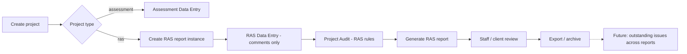

# Convert to RAS

**Status:** Planning / architecture note (not an implementation spec). **Not implemented.**  
**Last updated:** 2026-06-03  
**Audience:** Product owner, architecture review, implementation planning

> **Disclaimer:** This document captures internal planning for adapting FREDAsoft toward Registered Accessibility Specialist (RAS) workflows under the Texas Department of Licensing and Regulation (TDLR). It does **not** assert legal compliance, required forms, or final field lists. All TDLR/RAS requirements must be verified from official sources, sample deliverables, and qualified review before any implementation.

---

## 1. Purpose

FREDAsoft today supports accessibility inspection and reporting workflows used by consultants and inspectors: organizing work by project and facility, capturing structured deficiency records, attaching findings/recommendations/standards/photos/costs, and producing printable/PDF-style reports plus an internal Web Report Viewer.

This document records **current planning decisions** and open questions for adapting FREDAsoft so it can support inspections performed as **Registered Accessibility Specialists (RAS)** under TDLR-related expectations in Texas. The goal is to align product thinking, data model options, reporting shape, glossary direction, and phased delivery—**without** committing to code, schema, or compliance claims in this phase.

---

## 2. Background

RAS-related accessibility work in Texas is tied to state licensing and compliance-oriented inspection/reporting practices. Inspectors operating in that context typically need traceable project context, TAS-oriented standards, structured comments/deficiencies, reports with certification language, and eventually submission/retention workflows.

FREDAsoft already models much of the *mechanics* of inspection documentation. RAS support is planned as a **project-level type** and a **separate report/record shape** layered on shared infrastructure (projects, facilities, locations, photos, citations)—not a replacement of assessment/consulting workflows.

**Planning posture:** Decisions in sections 3–11 below reflect the latest architecture conversation. They are **not** shipped product behavior until implemented and reviewed per **AGENTS.md**.

---

## 3. Current FREDAsoft capabilities relevant to RAS

Existing areas that may **carry forward** for RAS (with gaps noted):

| Area | Relevance | RAS planning note |
|------|-----------|-------------------|
| **Project / facility / location** | Core structure | RAS adds project type + report instances; locations/areas still apply |
| **Data Entry (`projectData`)** | Record capture | RAS mode omits recommendations/costs; may add sheet/detail # |
| **Glossary (TAS 2012, UFAS, etc.)** | Templates | RAS projects: **TAS 2012 only**; separate **rasFindings** library for Plan Review |
| **Findings / recommendations** | Masters + snapshots | RAS uses **comments**; no recommendations on RAS reports |
| **Standards / citations** | TAS references | Retained; no recommendation citations |
| **Photos** | Per-record images | Retained; drawing references TBD for Plan Review |
| **Costs / financial** | Assessment reports | **Excluded** from RAS reports |
| **Web Report Viewer** | Read-only sections | RAS template likely drops Financial; other sections TBD |
| **PDF / Report Preview** | Sectioned PDF | RAS template separate from assessment template |
| **Project Audit** | QA warnings | Must not treat missing rec/cost as errors on RAS |
| **Future client portal + auth** | Published views | Phase 9+; outstanding-issues workflow across reports |

---

## 4. Project type (decided — planning)

FREDAsoft should support **project type** at the project level:

| Type | Meaning |
|------|---------|
| **`assessment`** | Current consulting/inspection-style work (default) |
| **`ras`** | Texas RAS/TDLR-oriented work |

**Rules (planning):**

- **RAS is selected when the project is created or configured** — not inferred per facility or per report only.
- **Existing projects default to `assessment`** — no silent conversion.
- **`ras` projects are TAS 2012 only** — glossary/standard enforcement must not break assessment projects that use other sets (UFAS, etc.).
- Assessment and RAS projects may coexist in one deployment; UI and validation branch on project type.

---

## 5. RAS report structure (decided — planning)

### Multiple report instances per RAS project

- A single **RAS project** can contain **multiple independent RAS report instances** (e.g. Preliminary Plan Review, then Revised Plan Review, then Official Inspection).
- **Report records are scoped to one report instance** — each instance has its own record set.
- **v1: no automatic carry-forward** of records from a prior report instance into a new one. Staff copy or re-enter as needed.
- **Future (bonus):** outstanding-issues dashboard / client response workflow that tracks items **across** report instances (not in v1).

### Implications

- Data model needs a **RAS report instance** entity (or equivalent) linking: division, report kind, dates, narrative/certification text, and child records.
- Web Report / PDF generation targets **one selected report instance** at a time.
- Project Audit may need instance-scoped or project-scoped modes later.

---

## 6. RAS divisions and report kinds (decided — planning)

RAS work splits into two **divisions**:

### Plan Review

| Report kind |
|-------------|
| Preliminary Plan Review |
| Revised Plan Review |
| Official Plan Review |

### Inspection

| Report kind |
|-------------|
| Special Inspection |
| Official Inspection |

### One template, configured per instance

All RAS report kinds can share **one RAS report template**, differentiated by configuration:

- Report **title / heading**
- **Division** (Plan Review vs Inspection)
- **Report kind** (from lists above)
- **Narrative / certification language** (instance- or kind-specific boilerplate)
- **Visible labels** (e.g. “Comment” vs legacy “Finding” in UI)

Exact legal wording for each kind remains subject to TDLR/sample verification.

---

## 7. RAS record and report fields (decided — planning)

### Excluded from RAS reports (and ideally from RAS Data Entry)

RAS reports **do not include**:

- Recommendations
- Recommendation citations
- Financials
- Quantities
- Unit costs
- Total costs

Assessment projects retain all of the above unchanged.

### Included on RAS report rows / records

| Field / concept | Notes |
|-----------------|-------|
| **Category** | From glossary / RAS library |
| **Item** | From glossary / RAS library |
| **Location / area** | Required for both divisions; Inspection primary locator |
| **Sheet / detail #** | **Plan Review:** support alongside location/area. **One free-text field**, e.g. `5/A4.2; 1/A15.3; C2.11` |
| **Comment** | Report-visible text (see §8) |
| **TAS reference(s)** | Standards/citations on record |
| **Photos / drawing references** | Where applicable; Plan Review may emphasize drawing refs |

### Division-specific UI (planning)

- **Plan Review:** show **Location / area** and **Sheet / detail #** (both meaningful).
- **Inspection:** **Location / area** primary; **Sheet / detail #** hidden or optional.

Internal storage may reuse existing `projectData` fields where possible; RAS mode hides or ignores recommendation/cost columns.

---

## 8. Finding vs Comment terminology (decided — planning)

| User-facing (RAS) | Internal / legacy |
|-------------------|-------------------|
| **Comment** | May still map to finding-style fields (`fldFindShort`, `fldFindLong`, etc.) |

**Planning rules:**

- **“Comment”** is the label on RAS reports and RAS Data Entry.
- **Short text** (`fldFindShort` or equivalent): library search, picker navigation, future table-style reports, internal use — **not** the primary line on RAS PDF in v1.
- **Long text** (`fldFindLong` or equivalent): **report-visible comment** for RAS v1.
- Do not require users to maintain duplicate short+long prose if only long is needed on the deliverable; short can remain a convenience field populated from library picks.

---

## 9. Glossary and library direction (decided — planning)

### RAS Plan Review library (`rasFindings`)

- **Do not** treat a straight clone of current assessment **findings** as the final authoritative RAS Plan Review library.
- **Preferred workflow:**
  1. Develop RAS comments in **spreadsheet batches** derived from TAS (start from **`templates/RAS_FINDINGS_TEMPLATE.xlsx`**)
  2. Review, edit, and vet internally
  3. **Import approved rows** into **`rasFindings`** (new collection or equivalent)

**Authoring workbook:** **`templates/RAS_FINDINGS_TEMPLATE.xlsx`** (layout: **`docs/RAS_FINDINGS_SPREADSHEET_TEMPLATE.md`**). **Import format spec:** column definitions, Firestore field map, dry-run rules, and validation report shape are in **`docs/RAS_FINDINGS_IMPORT_FORMAT.md`** (no importer yet).
- Existing TAS findings may be **reference/seed** content only; RAS library becomes **independent first-class** content.

### Identity and metadata (planning)

- **No `fldSourceFindID` required** for RAS library rows.
- **New IDs** for `rasFindings` entries.
- Useful metadata fields (illustrative):
  - `fldFindingLibraryType` = `ras_plan_review` (and similar for other RAS library types if needed)
  - `fldNeedsReview`
  - Review status
  - Finding/comment type
  - Applicability tags
  - Compound finding flag
- **Preserve** item and standards/citation relationships.
- **Do not include** recommendation or cost fields on RAS findings.

### RAS Inspection library

- Existing **inspection/assessment TAS glossary** may be **reusable** for RAS Inspection comments (field-observed wording).
- **Separate curated Plan Review library** is required for drawing/plan wording (see §10).

### Snapshot integrity (unchanged principle)

Keep distinct:

1. **Active glossary / library** at edit time  
2. **Saved record snapshots** on `projectData`  
3. **Report output** from snapshots, not live master re-resolution  

RAS conversion must not reintroduce category/item/comment resolution bugs audited in assessment workflows.

### Import safety

- Library import must support **dry-run and review** before Firestore writes (**AGENTS.md** data safety).

---

## 10. Plan Review vs Inspection comment wording (decided — planning)

| Division | Comment style (examples) |
|----------|---------------------------|
| **Plan Review** | Planned/drawing conditions: “Plans show…”, “The drawings indicate…”, “Insufficient information is provided…” |
| **Inspection** | Observed field conditions: “The lavatory is located…”, “The door lacks…” |

- **Plan Review** → curated **`rasFindings`** / Plan Review library.
- **Inspection** → may leverage existing **TAS inspection/assessment** glossary patterns where wording fits observed conditions.

---

## 11. Report metadata and header fields (decided — planning)

From sample RAS report review, header/metadata block should support (names may map to new or existing project/report fields):

| Field |
|-------|
| RAS Name / # |
| Review / Inspection Date |
| OCG Project # |
| TABS # |
| Project Name |
| Facility Name |
| Project Address |
| City / State / ZIP |
| Project Description |
| Scope of Work |
| Tenant Funds Provided |
| Owner name / address / city / state / ZIP |
| Architect / Design Professional / Design Firm |

Binding to **project** vs **report instance** vs **facility** to be finalized in Phase 1 architecture doc. TDLR-mandatory vs operational fields still require verification.

---

## 12. Reporting considerations

### Assessment baseline (unchanged today)

Assessment reports retain: Narrative, Financial, Documentation (finding + recommendation), Referenced Standards, Photo Addendum (Web Report and PDF paths as implemented).

### RAS template (planning)

| Topic | Direction |
|-------|-----------|
| **Template count** | One shared RAS template, configured per report instance (§6) |
| **Sections** | Likely: metadata/header, narrative/certification, comment table (category/item/location/sheet/TAS/photos), referenced standards, photo addendum — **no financial block** |
| **Labels** | “Comment” not “Finding”; no recommendation column |
| **Web Report** | RAS-specific viewer or mode; section toggles analogous to assessment where useful |
| **PDF** | Separate from `ReportPreview` assessment path until explicitly integrated; protect `ReportPreview.tsx` per **AGENTS.md** |

### Requirements still to investigate

- Exact page order, fonts, signature blocks, mandatory boilerplate per report kind
- Submission/export format (PDF only vs portal — TBD)

---

## 13. Workflow considerations (updated)

| Step | Assessment (today) | RAS (planned) |
|------|----------------------|---------------|
| Create project | Default type | Select `ras`; TAS 2012 locked |
| Report scope | Facility-level report | Per **report instance** |
| Capture records | Finding + rec + costs | Comment + TAS + location/sheet; no rec/cost |
| Audit | Rec/cost warnings OK | Missing rec/cost **not** errors |
| Generate report | Assessment PDF/Web | RAS template + instance config |
| Cross-report tracking | N/A in v1 | Future dashboard (Phase 9) |

---

## 14. Risks, gotchas, and open questions

### Implementation gotchas (planning)

| Risk | Mitigation direction |
|------|----------------------|
| Data Entry assumes **finding + recommendation** pairing | RAS mode hides rec fields; validation branches on project/report type |
| Report and audit logic assumes **recommendation/cost** fields | RAS audit rule pack; do not flag missing rec/cost as errors |
| Plan Review needs **location/area and sheet/detail** | Both on form; sheet as single free-text field |
| **Report instances** need isolated record scopes | Foreign key / scope filter on all RAS queries |
| **TAS 2012-only** enforcement on `ras` projects | Guardrails on glossary picker; never block assessment projects |
| **Library import** | Dry-run, batch review, no accidental production overwrite |
| Cloning assessment findings into RAS library | Use spreadsheet vetting → `rasFindings`; avoid authoritative clone |

### Regulatory and product questions (still open)

- Exact TDLR/RAS deliverable format and legally required fields
- Required forms or submission APIs (if any)
- Immutable audit log after submission?
- Corrections / re-inspection: new report instance only in v1 — workflow for amendments TBD
- Published snapshot vs live data for client portal

---

## 15. Proposed phased approach (updated)

Sequential phases; scope and timing require Archie/user approval each phase. **None of this is implemented** by this document alone.

| Phase | Focus | Outcomes |
|-------|--------|----------|
| **1** | Finalize RAS **data/report architecture** document | Project type, report instance model, field map, header metadata binding |
| **2** | Define RAS findings **spreadsheet / import format** | Column spec, validation rules, dry-run contract — **`docs/RAS_FINDINGS_IMPORT_FORMAT.md`** |
| **3** | Build / import curated **`rasFindings`** library in batches | Vetted Plan Review comments in Firestore |
| **4** | Add project-level type **`assessment` \| `ras`** | Default assessment; RAS → TAS 2012 only |
| **5** | Add **RAS report instance** model | Division, report kind, scoped records |
| **6** | Add **RAS Data Entry** mode | No recommendations/costs; Plan Review sheet/detail; Inspection location-first |
| **7** | Add **RAS report template** (PDF + Web) | Shared template; per-instance title/narrative/labels |
| **8** | Add **RAS-specific audit** checks | RAS blockers without rec/cost false positives |
| **9** | Client portal / **outstanding issues** across reports | Later; not v1 |

Each implementation phase: plan → Archie review → branch → lint/build → manual test → **✅ DECIDED** in `docs/ARCHITECTURE_DESIGN.md` when durable.

---

## 16. Requirements still to investigate (TDLR / operations)

Research backlog — confirm against official sources and sample deliverables:

- TDLR registration / TABS identifiers and required formatting
- Submission channels (portal, API, email/PDF only)
- Record retention and immutability after filing
- Mandatory certification/signature language per report kind
- Photo and drawing reference minimums

---

## 17. Non-goals for now

- **No application code** changes from this document alone  
- **No Firestore schema or rules changes** until architecture + migration approved  
- **No claim of TDLR legal compliance** until requirements verified  
- **No changes to assessment PDF/Report Preview** until RAS template is scoped separately  
- **No automatic carry-forward** of RAS records between report instances in v1  
- **No `rasFindings` production import** without dry-run and approval  
- **No package.json / dependency changes** for docs-only updates  

---

## Related documentation

- **`templates/RAS_FINDINGS_TEMPLATE.xlsx`** — blank RAS Plan Review findings authoring workbook (v1)
- **`docs/RAS_FINDINGS_IMPORT_FORMAT.md`** — spreadsheet columns, target **`rasFindings`** shape, import safety, dry-run report (Phase 2; planning only)
- **`docs/RAS_FINDINGS_SPREADSHEET_TEMPLATE.md`** — spreadsheet layout spec for the workbook
- `docs/ARCHITECTURE_DESIGN.md` — durable ✅ DECIDED blocks (add RAS decisions when implementation begins)
- `AGENTS.md` — protected areas, behavior disclosure, Firestore data safety

When implementation starts, add concise **✅ DECIDED** entries to `ARCHITECTURE_DESIGN.md` and keep this file as the full planning context.
