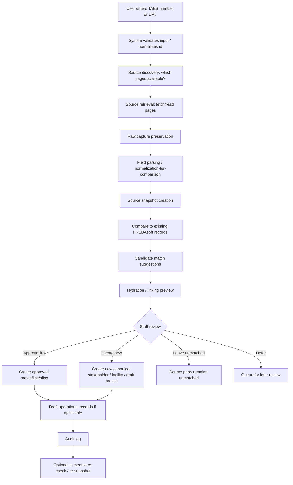

# FREDAsoft Project — TDLR/TABS Extraction Pipeline (D6 Sketch)

**Status:** Documentation-only architecture sketch (D6). **Not implemented.**  
**Last updated:** 2026-06-05  
**Branch context:** `tdlr-extraction-pipeline-sketch`  
**Audience:** Product owner (Kenneth), architecture review (Archie), implementation planning

> **Disclaimer:** This document sketches a **future** TDLR/TABS extraction pipeline for FREDAsoft Project. It does **not** specify scrapers, Firestore collections, security rules, migrations, credentials, or application code. It does **not** assert TDLR legal compliance or final field requirements. **No PDF content extraction** was performed for this task; field groups are derived from existing discovery docs only.

---

## Table of contents

1. [Purpose and scope](#1-purpose-and-scope)
2. [Source hierarchy](#2-source-hierarchy)
3. [User workflow](#3-user-workflow)
4. [Pipeline stages](#4-pipeline-stages)
5. [Conceptual data outputs](#5-conceptual-data-outputs)
6. [Field group mapping](#6-field-group-mapping)
7. [Source-vs-canonical rules](#7-source-vs-canonical-rules)
8. [Review and matching rules](#8-review-and-matching-rules)
9. [Security and compliance notes](#9-security-and-compliance-notes)
10. [Failure modes / edge cases](#10-failure-modes--edge-cases)
11. [Relationship to other D tasks](#11-relationship-to-other-d-tasks)
12. [Open questions for Kenneth / Archie](#12-open-questions-for-kenneth--archie)
13. [Non-goals](#13-non-goals)
14. [Recommended next docs](#14-recommended-next-docs)

---

## 1. Purpose and scope

### Purpose

Sketch how a future FREDAsoft user can enter a **TABS number** (or equivalent lookup key), retrieve available **TDLR/TABS project information** from appropriate source pages, **preserve as-recorded TDLR source data** in separate snapshot records, and then present **candidate links** and **draft operational records** for staff review—without conflating government source records with FREDAsoft canonical data.

This doc completes discovery phase **D6** (see **`docs/FREDASOFT_PROJECT_APP_DISCOVERY.md` §16**) and implements the extraction-pipeline implications from discovery §15 and **`docs/FREDASOFT_PROJECT_STAKEHOLDER_MODEL.md` §9**.

### Core product intent

| Step | Intent |
|------|--------|
| **Input** | User enters a TABS number (or accepted lookup variant) into FREDAsoft |
| **Retrieve** | System discovers and reads available TDLR/TABS source pages (public and/or authenticated, per future policy) |
| **Preserve** | System stores **as-recorded** TDLR source snapshots—never overwriting or correcting TDLR’s own records |
| **Compare** | System compares extracted source fields to existing FREDAsoft canonical records |
| **Suggest** | System proposes candidate matches, links, aliases, and/or draft operational records |
| **Review** | User/staff reviewer decides how to link or create canonical records |
| **Record** | Approved links and drafts are recorded **without** mutating TDLR source snapshots or silently overwriting canonical data |

### Mandatory architecture rule

**TDLR/TABS source data and FREDAsoft canonical/operational data are separate.**

- FREDAsoft does **not** overwrite, correct, or replace TDLR source data.
- TDLR maintains its own authorized TABS process for editing government/source records.
- FREDAsoft canonical **stakeholders**, **facilities**, **projects**, **report instances**, and **client** records are separate internal records.
- Connections between tracks use **explicit match/link/alias records** created only after user approval.

### In scope (this document)

- Conceptual pipeline stages and data outputs
- Source hierarchy and reconciliation notes (EAB205N vs TABS UI captures)
- User/staff review workflow and matching posture
- Field group mapping from existing docs (not new PDF extraction)
- Security, failure modes, and open questions

### Out of scope

| Topic | Deferred to |
|-------|-------------|
| Scraper / browser automation / API client code | Future implementation branch |
| Firestore schema, rules, migrations | **D4** |
| PDF parser for EAB205N | Future EAB205N field extraction doc |
| Credentials, session handling, live TABS access | Future implementation + ops policy |
| UI wireframes for review queue | **D2** |
| Field-level FREDAsoft mapping spreadsheet | **D1** |
| Correspondence letter generation | **D7** |
| Portal submission/approval | **D8** |

---

## 2. Source hierarchy

Sources are ranked by **intended authority** for registration-field semantics. Implementation may read multiple sources per extraction run; reconciliation rules are in §7.

### 2.1 Primary registration-field source

| Source | Role | Notes |
|--------|------|-------|
| **EAB205N Project Registration form** (`eab205n-project-registration.pdf`) | **Primary intended registration-field source** | Defines intended registration fields (project, facility, parties, scope, RAS). Local copy: `C:\dev\FREDAsoftReferenceMaterials\`. Public URLs in **`docs/reference/TDLR_RAS_TABS_SOURCE_INDEX.md` §5. **Not fully extracted in D6**—field groups below are reconciled from index + TABS UI discovery, not line-by-line PDF parsing. |

**D6 reconciliation rule:** EAB205N defines **what fields exist and mean** on registration. TABS HTML/page captures show **how TABS implements and displays** those fields. D6 assumes both must align before implementation; discrepancies are open questions (§12).

### 2.2 TABS public extraction targets

| Source | Sanitized path (from captures) | Role |
|--------|-------------------------------|------|
| **TABS Search** | `/TABS/Search` | Lookup/discovery surface; filter parameters for portfolio search |
| **TABS Project Details** (search result / print view) | `/TABS/Search/Details`, `/TABS/Search/Print/{projectNumber}` | **Public read-only** extraction target; sectioned PROJECT / OWNER / RAS / TENANT / DESIGN FIRM display |
| **TABS public project URL** (inferred) | `/TABS/Projects/{projectNumber}` | Possible alternate public entry—key choice TBD (§12) |

**Strength:** No authentication required (policy permitting). Good default for v1 extraction shape per **`docs/reference/TDLR_TABS_FORM_FIELD_DISCOVERY.md` §5**.

**Limitation:** May omit richer milestone, document, contact-edit, and assignment fields visible only on authenticated pages.

### 2.3 TABS authenticated extraction sources

| Source | Sanitized path | Role |
|--------|----------------|------|
| **Manage Project** | `/TABS/Project/…` | Richer authorized extraction source **if allowed** by TDLR terms and FREDAsoft access policy |
| **Manage Documents** | `POST /TABS/Project/ManageDocuments` | CAD, LLO, AOF/SOS, proof-of-submission/inspection metadata |
| **Notifications / Letters** | `POST /TABS/Notification/Product`, `POST /TABS/Letters/Product` | Correspondence track (**D7**)—metadata for D6, not letter bodies in repo |
| **Payment** | `/TABS/Payment/CreateFeeDetail/{projectId}` | Fee milestone snapshot |
| **Project Registration wizard** | `/TABS/Project/ProjectRegistration` | Registration flow—not yet captured in reference folder |

**Strength:** Read-only `lbl*` labels, contacts table, Project Status Updates, Plan Review By / Inspection By, CAD number, document inventory.

**Constraint:** Requires authenticated session; must respect TDLR authorized access; never store credentials or tokens in repo (§9).

### 2.4 Supporting references (not live scrape targets)

| Source | Use in pipeline |
|--------|-----------------|
| **PDF forms** (EAB242N proof of submission, EAB244N proof of inspection, EAB243N agent, EAB247N LLO, etc.) | Milestone and party semantics; document attachment expectations |
| **Help sheets** (registration, CAD, ownership, sub-contractors, RAS notification) | Required-field checklists; upload rules |
| **RAS procedures** (`rasprocedures2018.pdf`, bulletins) | Operational workflow context—not registration field authority |
| **Official TDLR web** (ab.htm, abfaq.htm, form URLs) | Versioning, policy, public form parity checks |

Full inventory: **`docs/reference/TDLR_RAS_TABS_SOURCE_INDEX.md`**.

### 2.5 Source precedence (conceptual)

```text
EAB205N (intended field semantics)
        │
        ├──── reconcile ────► TABS Project Details (public display shape)
        │
        └──── reconcile ────► TABS Manage Project (authenticated display + history + docs)
```

When public and authenticated pages **differ**, FREDAsoft stores **both** as separate source snapshots (or versions within a run)—never silently picking a “winner” without staff review for canonical promotion (§7, §12).

---

## 3. User workflow

High-level staff journey from TABS number to linked FREDAsoft project context.



### Reviewer decision menu

After preview, staff may:

| Decision | Effect |
|----------|--------|
| **Approve link** to existing canonical stakeholder (or facility/project) | Creates explicit **approved match/link/alias** record |
| **Reject** suggested candidates | No link; suggestions discarded or marked rejected |
| **Create new** canonical stakeholder (or facility) | New canonical record + optional link to source party |
| **Leave unmatched** | TDLR source party stays source-only until reviewed |
| **Defer** | Extraction run and snapshots retained; matching queue pending |

**No decision** may overwrite TDLR source snapshots or canonical records without an explicit, auditable approved action.

---

## 4. Pipeline stages

Suggested stages for future implementation. Names are conceptual—not API endpoints or collection names.

| # | Stage | Description | Outputs (conceptual) |
|---|--------|-------------|----------------------|
| 1 | **Input / lookup request** | User supplies TABS number, legacy EABPRJ id, or paste URL; system validates format | Lookup request record |
| 2 | **Source discovery** | Determine which sources are reachable (public details, auth manage page, print view) | Source plan for this run |
| 3 | **Source retrieval** | HTTP/browser read of allowed pages; respect rate limits and terms | Raw HTML/PDF bytes (stored outside git; retention policy TBD) |
| 4 | **Raw capture preservation** | Store immutable raw capture reference (hash, timestamp, URL path, capture type) | Raw capture metadata |
| 5 | **Field parsing / normalization-for-comparison** | Extract labels and values; normalize whitespace/casing **only for comparison**—not for overwriting source snapshot text | Parsed field map |
| 6 | **Source snapshot creation** | Persist **as-recorded** project + party + milestone + document metadata rows | TDLR project/party/milestone snapshots |
| 7 | **Candidate match suggestion** | Rank existing canonical stakeholders, facilities, projects by signals (§8) | Candidate suggestion records |
| 8 | **Hydration / linking preview** | Show side-by-side TDLR-as-recorded vs FREDAsoft-canonical; propose draft project/facility/party rows | Draft operational candidates (uncommitted) |
| 9 | **User/staff review** | Human confirms, rejects, defers, or creates new | Review state on extraction run |
| 10 | **Reviewer decision** | Approve link / create new / leave unmatched / defer | Approved link, alias, or new canonical draft |
| 11 | **Approved link / alias / draft creation** | Persist only **approved** associations and drafts | Match/link/alias records; draft operational records |
| 12 | **Audit / history logging** | Who ran extraction, who approved links, source snapshot ids, timestamps | Extraction run log + audit trail |
| 13 | **Re-check / re-snapshot flow** | Scheduled or manual re-fetch when TDLR may have changed | New snapshot version; diff vs prior (no silent mutation) |

### Parsing vs promotion

| Layer | Trust level | Mutability |
|-------|-------------|------------|
| Raw capture | Forensic | Append-only per run |
| Source snapshot | Legal/source as recorded | Append/version; never FREDAsoft-corrected |
| Parsed field map | Machine extraction | Tied to snapshot; regenerated on re-parse |
| Candidate suggestions | Assistive | Discarded or superseded on re-run |
| Approved links / canonical | Operational | Staff-maintained; not auto-overwritten from new scrape |

---

## 5. Conceptual data outputs

**Collection names are not finalized.** Below describes **record families** for D4 schema sketching.

### 5.1 Source track (TDLR-as-recorded)

| Record family | Contents |
|---------------|----------|
| **TDLR project source snapshot** | TABS #, legacy project id, project name, facility name, site address, status, scope, cost/schedule/classification flags, extraction provenance |
| **TDLR party source snapshot** | Owner, Design Firm, RAS, Tenant, Agent, Person Filing Form—names, addresses, phones, emails, business type, license # **as displayed** |
| **TDLR milestone / source event snapshot** | Registration, Plan Review, Inspection rows; report dates; submitted-on dates; status text from Project Status Updates |
| **TDLR document / source attachment metadata** | Document type (CAD, LLO, AOF/SOS, proof of submission/inspection), filename reference, upload/submission dates—not binary in git |

### 5.2 Extraction run / inventory

| Record family | Contents |
|---------------|----------|
| **Extraction run log** | Requested id, sources attempted, success/failure, timestamps, staff initiator, raw capture refs |
| **Source field inventory / parsed field map** | Normalized key → as-recorded value, source page section, HTML id/label where known (from D5.5 discovery) |

### 5.3 Matching and linking track

| Record family | Contents |
|---------------|----------|
| **Candidate match suggestion record** | Suggested canonical id, confidence/rank, signals used (exact name, license #, address, prior link), reviewer status |
| **Approved match/link record** | Explicit link: source snapshot party ↔ canonical stakeholder; or project snapshot ↔ FREDAsoft Project |
| **Stakeholder alias / observed name** | Text variant from TDLR linked to canonical after approval |

### 5.4 Operational draft track (pre-promotion)

| Record family | Contents |
|---------------|----------|
| **Draft operational project candidate** | Proposed FREDAsoft Project fields derived from snapshot—**not** promoted until review |
| **Draft operational facility candidate** | Proposed Facility link/create from site text |
| **Draft operational stakeholder candidate** | Proposed canonical org/person from party row |
| **Draft report-instance hints** | Plan review / inspection dates and assigned professionals—binding to CONVERT_TO_RAS instances TBD |

**Rule:** Drafts are **suggestions**. Promotion to trusted canonical/operational use requires explicit staff action (§7–§8).

---

## 6. Field group mapping

Derived from **`docs/reference/TDLR_TABS_FORM_FIELD_DISCOVERY.md`**, **`docs/reference/TDLR_RAS_TABS_SOURCE_INDEX.md`**, **`docs/FREDASOFT_PROJECT_STAKEHOLDER_MODEL.md`**, and **`docs/CONVERT_TO_RAS.md` §11**—**not** from new EAB205N PDF line extraction.

### 6.1 Project identifiers

| TDLR / TABS concept | Example sources | FREDAsoft candidate (after review) |
|---------------------|-----------------|-------------------------------------|
| TABS number | `filter-project-number`, Details **Project Number**, `lblProjectId` cross-ref | TDLR snapshot primary id; link to **Project** metadata |
| Legacy EABPRJ / project id | `filter-project-number-version` = EABPRJ, `lblProjectId` | Separate snapshot field; cross-ref not auto-merge |
| `DataVersionId` | Hidden field; search version filter | Snapshot metadata (numbering era) |
| Internal `ProjectId` GUID | Hidden | Snapshot provenance only—not FREDAsoft id |

### 6.2 Project / facility

| Field group | TABS labels / ids | FREDAsoft candidate |
|-------------|-------------------|---------------------|
| Project name | Project Name, `lblProjectName` | **Project** + snapshot |
| Facility name | Facility Name, `lblBuildingorFacilityName` | **Facility** + snapshot |
| Location address | Location Address, `lblProjectAddress` | **Facility** address + snapshot |
| City | `filter-location-city`, `USCity` (modals) | Snapshot; city **numeric id** lookup TBD |
| County | Location County, `USCounty` | Snapshot / Facility |
| CAD number | `lblProjectCADNumber`, help sheets | Snapshot + document metadata |

### 6.3 Schedule / cost / scope

| Field group | TABS labels / ids | FREDAsoft candidate |
|-------------|-------------------|---------------------|
| Start date | Start Date, `lblProjectEstStartdate` | Project metadata / snapshot |
| Completion date | Completion Date, `lblProjectEstEnddate` | Project metadata / snapshot |
| Estimated cost | Estimated Cost, `lblProjectEstCost` | Snapshot (**not** inspection cost) |
| Square footage | Square Footage, `lblProjectEstimateOfSquareFootage` | Snapshot |
| Type of work | Type of Work, Job Class (`lblProjectJobClass`) | Snapshot classification |
| Type of funds | Type of Funds, Owner Class (`lblProjectOwnerClass`) | Snapshot / funding flags |
| Scope | Scope of Work, `lblProjectScopeOfWork` | **Project** description |
| Tenant funding flag | Private funds by tenant, `lblProjectPrivateFunds` | Snapshot flag |
| State lease / special / roadway | `lblProjectStateLease`, `lblSpecialProjectCategory`, `lblIsRoadwayConstruction` | Snapshot flags |

### 6.4 Parties

| Role | TABS sections / ContactType | FREDAsoft candidate (D5) |
|------|----------------------------|---------------------------|
| **Owner** | Details OWNER; modal `Owner`; `filter-owner-name` | **Owner** project party → canonical stakeholder |
| **Design Firm** | Details DESIGN FIRM; `Design_Firm`; `ArchitectName` search param | **Design Firm** party |
| **Tenant** | Details TENANT; modal `Tenant` | **Tenant** party |
| **Agent** | Agent modal; EAB243N (PDF ref) | **Agent** party |
| **RAS** | Details RAS; `filter-ras-number`; read-only RAS modal | **RAS Firm** + **assigned RAS** |
| **Person filing form** | PERSON FILING FORM **Contact Name** | **Contact person** (not necessarily Owner) |
| **BusinessType** (Owner modal) | Corporation, Individual, LLC, … | Stakeholder **entity type** (D5 §3.3) |

### 6.5 RAS / report workflow

| Field group | TABS labels | FREDAsoft candidate |
|-------------|-------------|---------------------|
| RAS name / # | RAS Name, RAS #, `LicenseNumber` | Snapshot + canonical RAS firm |
| RAS address / phone | Details RAS | Canonical stakeholder / contact |
| Plan Review By | `lblProjectPlanReviewBy` | **Assigned RAS** / professional |
| Inspection By | `lblProjectInspectionBy` | **Assigned RAS** / professional |
| Project status | Current Status, `lblProjectStatus`, filter enums `3001`–`3009` | Snapshot status |
| Status updates | Project Status Updates table | Milestone snapshot; **RAS report instance** dates (CONVERT_TO_RAS) |
| Plan review / inspection dates | Report Date, Submitted On columns | Report instance / correspondence triggers (D7) |

### 6.6 Documents / correspondence

| Document type | Source hints | FREDAsoft candidate |
|---------------|--------------|---------------------|
| CAD | CAD help sheet, Manage Documents | Attachment metadata on snapshot |
| LLO / AOF / SOS | Ownership help, LLC/LP modals | Attachment metadata; party entity type |
| Proof of submission (EAB242N) | PDF index; status table | Plan review milestone; link to report instance |
| Proof of inspection (EAB244N) | PDF index; status table | Inspection milestone |
| Notifications / letters | Manage Project menus | **D7** correspondence log—not inspection PDF |

### 6.7 Status / milestones

| Milestone | TABS signals | Notes |
|-----------|------------|-------|
| Project Registered | Status `3008`, registration row | Snapshot event |
| Review Complete | Status `3009` | Snapshot event |
| Inspection Complete | Status `3001` | Snapshot event |
| Project Closed | Status `3007` | Snapshot event |
| Corrective modifications | Manage menu | Future workflow |
| Request for closure | Manage menu | Milestone / D7 |

---

## 7. Source-vs-canonical rules

Explicit rules governing how TDLR source and FREDAsoft operational data interact.

| # | Rule |
|---|------|
| **SV-1** | **TDLR source values are preserved as recorded** at extraction time—in display text, snapshot fields, and raw capture references. |
| **SV-2** | **FREDAsoft canonical values are separately maintained** by staff (and future portal-approved updates per D8). |
| **SV-3** | **Match/link records connect** source snapshots to canonical entities—never implicit equality. |
| **SV-4** | **Hydration creates draft operational records and/or suggested links**—not trusted canonical truth until reviewed. |
| **SV-5** | **No blind overwrite** of source snapshots or canonical records when a new extraction run occurs or when fields differ. |
| **SV-6** | **Re-scraping creates new source snapshots or versions**, not silent in-place mutation of prior snapshots. Staff may compare versions. |
| **SV-7** | **Matching is assistive, not authoritative.** FREDAsoft may rank suggestions; it must **not** auto-merge TDLR source parties into canonical stakeholders. |
| **SV-8** | **FREDAsoft does not correct TDLR source data.** Discrepancies remain visible; corrections happen only in TDLR’s authorized TABS process. |
| **SV-9** | **One TDLR project snapshot** may link to **one FREDAsoft Project** context after approval—but snapshots remain a separate track from the Project document. |
| **SV-10** | **Multiple TDLR raw party variants** may link to **one canonical stakeholder**—but only after **user-approved** alias/link records (D5 §3.4). |
| **SV-11** | **Normalization for comparison** (trim, case-fold for matching) must not replace stored as-recorded snapshot text. |

---

## 8. Review and matching rules

### 8.1 Matching posture

FREDAsoft **must not unilaterally decide** that a TDLR party is the same as an existing canonical stakeholder.

| Capability | Allowed? |
|------------|----------|
| Exact match suggestion (name, license #) | Yes — **candidate only** |
| Fuzzy match suggestion (name, address) | Yes — **candidate only** |
| Alias-based suggestion (prior approved links) | Yes — **candidate only** |
| Auto-merge into canonical stakeholder | **No** |
| Auto-approve link without staff action | **No** (current assumption; confirm §12) |

### 8.2 Reviewer experience (requirement candidates)

| Requirement | Description |
|-------------|-------------|
| **Side-by-side display** | TDLR-as-recorded vs FREDAsoft-canonical for each party and key project field |
| **Candidate list** | Ranked suggestions with signals explained (e.g. “license # exact match”) |
| **Actions** | Approve link / reject / create new / leave unmatched / defer |
| **Audit** | Approver, timestamp, source snapshot id, prior canonical state |
| **Unmatched queue** | Source parties without links remain visible until reviewed |

### 8.3 Matching signals (candidates—not finalized)

Signals FREDAsoft **may** use to **suggest** candidates (not auto-approve):

- Exact or normalized **name** match
- **Fuzzy** name match (threshold TBD)
- Prior **approved link** or **alias** for same text
- **RAS license number**
- **Address** line, city, zip (weighted TBD)
- **Email** or **phone** (handle PII access control)
- **Design firm license number**
- **BusinessType** alignment with stakeholder entity type

### 8.4 Project and facility linking

| Scenario | Rule |
|----------|------|
| TABS project → FREDAsoft Project | One approved project link; drafts may pre-fill Project metadata |
| Site text → Facility | Suggest Facility link or new Facility draft; do not overwrite Facility from TDLR without review |
| No appropriate match | User may **create new** canonical stakeholder or **leave unmatched** |
| User rejects all candidates | Source party stays unmatched; no link record |
| User defers | Extraction run stays in review queue |

### 8.5 Approved links

Only **user-approved** associations become **approved match/link/alias** records. Approved links should be **auditable** and reversible through a controlled unlink workflow (implementation TBD).

---

## 9. Security and compliance notes

| Topic | Requirement |
|-------|-------------|
| **Credentials** | No TABS credentials stored in repo, docs, or git history |
| **Session tokens** | Do not log `__RequestVerificationToken`, `LoginId`, `userid` query params, or session cookies |
| **Raw captures** | Do not commit HTML saves, screenshots, or PDFs to FREDAsoft repo |
| **PII** | Contact fields (email, phone, address) require **access control** in future design; minimize PII in logs |
| **TDLR terms** | Respect TDLR authorized access and terms of use; distinguish **public** vs **authenticated** extraction in policy |
| **Rate limiting** | Future implementation should avoid aggressive scraping; prefer official public pages where sufficient |
| **Reference materials** | `C:\dev\FREDAsoftReferenceMaterials\` and Drive library remain **outside repo** per source index |
| **Anti-forgery fields** | Capture metadata only—never persist token values |

---

## 10. Failure modes / edge cases

| Failure / edge case | Pipeline behavior (conceptual) |
|---------------------|--------------------------------|
| **TABS number not found** | Run log = failure; user message; no snapshot created |
| **Multiple search matches** | Present disambiguation list; do not auto-pick |
| **Legacy EABPRJ vs TABS number** | Support version filter (`TABS` / `EABPRJ` / `All`); store both when present; linking key TBD |
| **Project unavailable / auth required** | Fall back to public details if available; flag partial extraction |
| **Project updated since last snapshot** | Re-snapshot creates **new version**; show diff to staff; no silent canonical update |
| **Conflicting owner/design/RAS values** | Store each as-recorded; surface conflict in review UI; staff resolves via links—not source edit |
| **Incomplete public detail page** | Mark extraction **partial**; optional auth second pass if policy allows |
| **City/county numeric id lookup unavailable** | Store numeric id in snapshot; label resolution deferred or manual |
| **Project status changes** | New milestone snapshot rows; status history append-only |
| **Documents missing or inaccessible** | Document metadata partial; log gaps; no fabricated placeholders |
| **Low candidate match confidence** | Show as low-confidence or empty; user may create new or defer |
| **User rejects all suggested matches** | No link; unmatched source party retained |
| **User defers stakeholder matching** | Run stays in queue; snapshots preserved |
| **Public vs authenticated field mismatch** | Both snapshots kept; staff chooses promotion source for drafts (§12) |
| **Link expire (search links 7 days)** | Do not rely on ephemeral URLs for long-term provenance—store snapshot at extract time |

---

## 11. Relationship to other D tasks

| Task | Deliverable | Relationship to D6 |
|------|-------------|-------------------|
| **D5** | **`docs/FREDASOFT_PROJECT_STAKEHOLDER_MODEL.md`** | Dual-track model, party taxonomy, matching workflow—D6 implements extraction side of D5 §9–§10 |
| **D5.5** | **`docs/reference/TDLR_TABS_FORM_FIELD_DISCOVERY.md`** | TABS UI field inventory—D6 pipeline target shapes and parsed field keys |
| **D1** | Field-level mapping spreadsheet | Maps §6 groups to FREDAsoft candidate fields; depends on EAB205N review |
| **D2** | Workflow wireframes | Review queue, side-by-side UI, TABS entry point |
| **D4** | Firestore schema sketch | Instantiates §5 record families—after D1/D2 |
| **D7** | Correspondence requirements | Notifications, letters, proof-of-submission/inspection from Manage Project |
| **D8** | Portal submission/approval | Canonical updates separate from TDLR extraction; portal must not overwrite TDLR track |

**Source index:** **`docs/reference/TDLR_RAS_TABS_SOURCE_INDEX.md`** — review tracker for EAB205N and help sheets before D1/D4.

**RAS planning:** **`docs/CONVERT_TO_RAS.md`** §11 header fields and report instances consume **approved** operational links—not raw TDLR snapshots directly on deliverables (exact header authority TBD in D5 §17).

**Discovery:** **`docs/FREDASOFT_PROJECT_APP_DISCOVERY.md` §15–§16** — product intent and phased follow-ups.

---

## 12. Open questions for Kenneth / Archie

1. Should first implementation target **public Project Details only**, **authenticated Manage Project only**, or **both**?
2. Should a user paste a **TABS number only**, or also a **full TABS URL**?
3. Which source should populate **first draft project fields** when public and authenticated pages differ?
4. How often should FREDAsoft **re-check TDLR** (manual only, on open, scheduled)?
5. Should source snapshots be **immutable per extraction run** (append-only), or allow staff-marked “superseded”?
6. Which fields are safe to **auto-draft** on Project/Facility vs **always require review**?
7. Should **EAB205N field extraction** (PDF index doc) be done **before D1** field mapping?
8. How should **proof-of-submission** / **proof-of-inspection** documents relate to **RAS report instances** (CONVERT_TO_RAS)?
9. What **matching signals** are acceptable for candidate suggestions (especially fuzzy name/address)?
10. Should **any match ever be auto-approved**? **Current assumption: no.**
11. How should the UI present **“suggested existing stakeholder”** vs **“create new stakeholder”** vs **“leave unmatched”**?
12. Should **legacy EABPRJ** and **TABS** numbers be separate required snapshot fields on every run?
13. How should **Plan Review By** / **Inspection By** relate to **assigned RAS** vs **RAS Firm** on the registration (D5.5 §7.4)?
14. Should city/county **numeric ids** be resolved at extract time or stored as ids until lookup tables exist?
15. Is **Project Registration wizard** capture (`/TABS/Project/ProjectRegistration`) required before implementation?
16. Which **EAB205N PDF revision** is authoritative vs local `FREDAsoftReferenceMaterials` copy?

---

## 13. Non-goals

- No scraper, browser automation, or PDF parser **implementation**
- No Firebase/Firestore **schema**, **rules**, or **migrations**
- No **credentials**, session stores, or live TABS access in this repo
- No **source captures** (HTML, JPG, PDF) committed to git
- No **Supabase/Lovable** port or prototype code import
- No **auto-merge** or **auto-approval** of stakeholder matches
- No **full EAB205N PDF content extraction** in this D6 task
- No changes to **`src/**`**, **`package.json`**, **`scripts/**`**, Firestore rules, or **`content/**`**

---

## 14. Recommended next docs

| Priority | Deliverable | Purpose |
|----------|-------------|---------|
| 1 | **EAB205N field extraction/index doc** | Line-by-line registration field catalog from primary PDF; reconcile with D5.5 |
| 2 | **D1 field mapping spreadsheet/doc** | §6 groups → FREDAsoft candidate fields |
| 3 | **D2 workflow wireframe** | TABS entry, review queue, side-by-side matching UI |
| 4 | **D4 Firestore schema sketch** | After D1/D2; instantiate §5 record families |

Secondary: **D7** correspondence spec (notifications, letters, proof forms); **D8** portal approval for canonical updates.

---

## Related documentation index

| Document | Relevance |
|----------|-----------|
| **`docs/FREDASOFT_PROJECT_APP_DISCOVERY.md`** | §15 dual-track; §16 D6 placement |
| **`docs/FREDASOFT_PROJECT_STAKEHOLDER_MODEL.md`** | Canonical vs snapshot; matching; party roles |
| **`docs/reference/TDLR_TABS_FORM_FIELD_DISCOVERY.md`** | TABS UI field inventory (D5.5) |
| **`docs/reference/TDLR_RAS_TABS_SOURCE_INDEX.md`** | EAB205N, PDFs, official URLs |
| **`docs/CONVERT_TO_RAS.md`** | RAS report instances; §11 header fields |
| **`docs/ARCHITECTURE_DESIGN.md`** | ✅ DECIDED blocks |
| **`AGENTS.md`** | Protected areas; no Firestore writes without approval |

---

## Document control

| Item | Value |
|------|-------|
| Created | 2026-06-05 |
| Phase | D6 TDLR/TABS extraction pipeline sketch |
| FREDAsoft implementation | **None** |
| EAB205N PDF parsed in this pass | **No** |
| TABS captures in repo | **None** |
| Credentials / tokens in doc | **None** |
| PII quoted | **None** |
