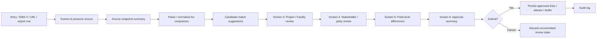

# FREDAsoft TDLR Review Workflow

**Status:** Documentation-only workflow and wireframe spec (D2). **Not implemented.**  
**Last updated:** 2026-06-05  
**Branch context:** `d2-tdlr-review-workflow-wireframes`  
**Audience:** Product owner (Kenneth), architecture review (Archie), D3/D4/D6/D8 planning

> **Disclaimer:** This document defines **review workflow steps**, **wireframe-level screen sections**, and **reviewer action outcomes** for TDLR/TABS intake. It does **not** specify Firestore collections, security rules, React components, scrapers, or application code. It does **not** collapse TDLR/TABS source data into FREDAsoft canonical data.

---

## Purpose

D2 defines how **staff reviewers** turn TDLR/TABS **source snapshots** into **reviewed FREDAsoft links, aliases, and draft operational records**—without overwriting government source data or silently promoting extracted values to canonical truth.

This is a **workflow and wireframe document**, not an implementation spec or schema sketch. It builds on:

| Prior doc | Role in D2 |
|-----------|------------|
| **`docs/FREDASOFT_PROJECT_FIELD_LEVEL_MAPPING.md`** (D1) | Field concepts, reviewer-action legend, source layers |
| **`docs/FREDASOFT_PROJECT_STAKEHOLDER_MODEL.md`** (D5) | Party roles, dual-track rules, matching posture |
| **`docs/FREDASOFT_PROJECT_TDLR_EXTRACTION_PIPELINE.md`** (D6) | Pipeline stages, source hierarchy, matching rules |
| **`docs/reference/*`** | EAB205N, TABS UI, open-records export field indexes |

**Outputs of D2:** screen inventory, reviewer decision menu, action/outcome matrix, error states, and open questions for D3 (RAS report instances), D4 (schema), D6 (implementation), and D8 (portal).

---

## Workflow Principles

| # | Principle |
|---|-----------|
| **WP-1** | **Source snapshot first** — every review session begins from preserved, as-recorded TDLR/TABS data (live scrape, export row, or both), not from FREDAsoft canonical records. |
| **WP-2** | **Side-by-side comparison** — TDLR-as-recorded values appear beside FREDAsoft candidates; reviewers never edit TDLR source text in FREDAsoft. |
| **WP-3** | **Reviewer-gated promotion** — only explicit staff actions create links, aliases, project parties, or draft canonical updates. |
| **WP-4** | **No auto-merge** — matching is assistive; FREDAsoft may rank candidates but must not auto-approve links or overwrite canonical records. |
| **WP-5** | **Explicit approve / reject / defer actions** — every party, project, and facility decision records a chosen outcome; deferral is a first-class queue state. |
| **WP-6** | **Field-level provenance** — each compared field shows which source layer supplied the value (EAB205N semantics, TABS public, TABS manage, export row) and extraction timestamp. |
| **WP-7** | **Links and aliases are auditable** — approved associations record reviewer, timestamp, source snapshot id, and prior canonical state. |
| **WP-8** | **Export and live TABS can disagree** — when open-records export and live TABS differ, both are preserved; staff chooses which source to trust for *comparison* only, not for silent canonical overwrite. |
| **WP-9** | **Client ≠ Owner** — Owner is a project party role from TDLR; Client is FREDAsoft portfolio/billing anchor; linking them requires an explicit reviewer decision. |
| **WP-10** | **Drafts are suggestions** — proposed Project/Facility/stakeholder field values remain drafts until approved; they never replace canonical records without review. |

---

## Primary User Roles

| Role | Primary in D2? | Responsibilities in this workflow |
|------|----------------|-----------------------------------|
| **Staff Reviewer** | **Yes** | Initiates TDLR lookup, reviews side-by-side matches, approves/rejects/defers links and drafts, submits approval summary. Typical internal FREDAsoft user (project admin, operations staff). |
| **Admin / Product Owner** | Secondary | Configures policies (which sources allowed, PII access), resolves escalated conflicts, may re-open deferred items. Same review screens; elevated actions TBD in D4/D8. |
| **RAS user (assigned professional)** | Reference only | May *initiate* lookup for projects they work on, but **matching and canonical promotion remain staff-gated** in v1. Assigned RAS is distinct from TDLR **RAS Firm** party on registration. |
| **Future portal stakeholder** | **Deferred (D8)** | Self-service TDLR lookup or master-data proposals are out of scope for D2 wireframes; portal flows will reuse the same dual-track rules when designed. |

---

## Entry Points

| Entry point | Typical use | Wireframe note |
|-------------|-------------|----------------|
| **Paste TABS number** | Primary path; user enters TABS # (or legacy EABPRJ id with era flag) | Screen 1 — number input + version/era selector when applicable |
| **Paste TABS URL** | User copies public Details or Manage Project URL | Screen 1 — URL parser extracts project number; warns if URL requires auth staff lacks |
| **Select / import open-records export row** | Bulk legacy compare; row keyed by `Project Number` | Screen 1 — optional export file/row reference;<br>loads export snapshot alongside or instead of live fetch |
| **Start from FREDAsoft Project** | Existing Project missing TDLR link | Screen 1 pre-filled with Project context; reverse lookup by name/address/TABS metadata if known |
| **Start from Facility or Client** | Portfolio context — find TDLR registrations for a site or client portfolio | Screen 1 — search filters; may queue multiple TABS numbers for sequential review |
| **Revisit previously deferred match** | Matching queue / deferred extraction run | Lands on Screen 3 or 4 with prior snapshot and partial decisions restored |

---

## High-Level Flow

D6 pipeline language adapted for the **human review slice**:

```text
extract
  → source snapshot
  → parse / normalize-for-comparison
  → candidate match
  → staff review
  → approved link / alias / draft
```

<!-- -->



**Navigation rule:** Screens 2–6 are sequential by default; reviewer may jump back to adjust a decision before final submit. No canonical writes occur until Screen 6 submit.

---

## Screen 1: TDLR Lookup / Intake

**Goal:** Accept lookup input, run extraction (or attach export reference), show status before review begins.

### Wireframe sections

| Section | Contents |
|---------|----------|
| **TABS number / URL input** | Text field for TABS #; optional URL paste; legacy **EABPRJ** era selector (`DataVersionId` / version filter per D1); normalize input before lookup. |
| **Optional export row / file reference** | Attach local export workbook row key (`Project Number`) or uploaded export slice; does not import row data into canonical—creates export **source snapshot** reference only. |
| **Extraction status** | Per-source progress: public Details, authenticated Manage Project (if policy allows), export row attached; success / partial / failed indicators. |
| **Source freshness** | Timestamp of each capture; “last reviewed in FREDAsoft” if prior extraction run exists; link to prior snapshot version. |
| **Export vs live TABS warning** | Banner when export row and live TABS values conflict on key fields (project name, status, owner, address); lists conflicting fields; **does not auto-resolve**. |
| **Action buttons** | **Continue to review** (enabled when ≥1 source snapshot exists); **Retry extraction**; **Cancel**; optional **Export-only review** when live TABS unreachable. |

---

## Screen 2: Source Snapshot Summary

**Goal:** Read-only presentation of as-recorded TDLR data before matching begins. **No editing of TDLR values.**

### Wireframe sections

| Block | Contents |
|-------|----------|
| **Project identity** | TABS #, legacy id cross-ref, project name, current status, registration/created dates, CAD account #. |
| **Status / milestone** | Current status enum/text; Project Status Updates rows when available (registration, plan review, inspection, closed); plan review by / inspection by when from Manage Project. |
| **Facility / site** | Facility name, location address (street, suite, city, county, zip), square footage, type of work, type of funds, scope, schedule dates, estimated cost. |
| **Party roster** | Summary cards for Owner, Tenant, Design Firm, RAS / RAS Firm, Agent, Person Filing Form / registrant—name + primary contact line each. |
| **Source provenance** | Table: field group → source layer (EAB205N semantics / TABS Details / TABS Manage / export) → capture timestamp → raw capture ref (internal). |
| **As-recorded values** | All text shown exactly as extracted; gaps labeled “not in this source” rather than filled from another layer. |

**Footer actions:** **Next: Match Project & Facility**; **Defer entire registration**; **Cancel**.

---

## Screen 3: Project / Facility Match Review

**Goal:** Link TDLR project/site context to FREDAsoft **Project** and **Facility** without collapsing tracks.

### Layout

Two-column **side-by-side** wireframe:

| Left — TDLR source | Right — FREDAsoft candidates |
|--------------------|------------------------------|
| Project name, TABS #, status, scope, schedule | Ranked **Project** candidates with confidence indicator |
| Facility name, site address, county | Ranked **Facility** candidates (may belong to selected or different Client) |
| Source provenance chips per field | **Candidate reason** text (e.g. “exact TABS # prior link”, “address + name fuzzy match”) |

### Confidence indicators

Display rank and signals used (exact TABS link, name match, address match, prior approved alias)—**never** auto-select without reviewer confirmation.

### Reviewer choices (Project)

| Action | Outcome |
|--------|---------|
| **Approve link to existing Project** | Creates approved project snapshot ↔ Project link |
| **Create draft Project** | Opens draft Project form pre-filled from snapshot; requires Client context selection |
| **Leave unmatched** | Snapshot remains source-only; no Project link |
| **Defer** | Queue project-level matching; proceed to parties or exit |
| **Reject candidate** | Dismisses suggested Project(s); may search manually |

### Reviewer choices (Facility)

| Action | Outcome |
|--------|---------|
| **Approve link to existing Facility** | Approved Facility link; may differ from Project’s current Facility |
| **Create draft Facility** | Draft under selected Client |
| **Link/create via Project** | When Project selected, inherit or override Facility association |
| **Leave unmatched** | Site text stays on snapshot only |
| **Defer / reject** | Same semantics as Project |

**Note:** One TDLR project snapshot → one FREDAsoft Project link after approval; Facility may be shared across projects.

---

## Screen 4: Stakeholder / Party Match Review

**Goal:** Review each TDLR party row and decide canonical stakeholder, contact, and project-party links.

### Party rows (one expandable row each)

| Party role | Source snapshot fields (typical) | FREDAsoft targets |
|------------|----------------------------------|-------------------|
| **Owner** | Name, address, phone, email, representative, business type | Canonical stakeholder + **Owner** project party + contact person(s) |
| **Tenant** | Name, address, phone, email | Canonical stakeholder + **Tenant** project party |
| **Design Firm** | Firm name, address, phone, email, design professional, license | Stakeholder + **Design Firm** party + contact person |
| **RAS / RAS Firm** | RAS name, RAS #, address, phone | **RAS Firm** party; split firm vs individual TBD (D3) |
| **Agent** | Name, representative, address, email, phone | **Agent** project party (often absent from export) |
| **Contact persons / registrant** | Person Filing Form contact; owner/design/agent representatives | **Contact person** records affiliated to parent stakeholder |

### Per-row wireframe columns

| Column | Contents |
|--------|----------|
| **Source party snapshot** | As-recorded name, address, phone, email, license, business type |
| **Candidate canonical stakeholder / contact** | Top N ranked matches with confidence |
| **Candidate reason** | Signals: license # exact, prior alias, fuzzy name+address, etc. |
| **Reviewer action** | Approve link · Create new · Create alias only · Leave unmatched · Defer · Reject |
| **Alias / link result (preview)** | Shows pending alias text and project party role to be created on submit |

**Client ≠ Owner:** Separate optional action “Link Owner to existing Client” — explicit, never default.

**Empty / Not Assigned:** TABS “Not Assigned” tenant or missing Agent → row still shown; default action often **Leave unmatched** or **Defer**.

---

## Screen 5: Field-Level Differences

**Goal:** Field-by-field diff across source layers and FREDAsoft canonical/draft targets; choose what becomes a **draft suggestion only**.

### Wireframe sections

| Section | Contents |
|---------|----------|
| **Fields that match** | Collapsed list; green/neutral indicator; no action required |
| **Fields that differ** | Side-by-side: TDLR snapshot vs linked canonical Project/Facility/stakeholder vs pending draft |
| **Present only in EAB205N / TABS** | e.g. Agent block, owner business type, person filing form, milestone history — snapshot-only badge |
| **Present only in export** | e.g. `Current Status`, `ProjectCreatedOn`, decomposed `Address2`, `RASAddress` — export-layer badge |
| **Stale export vs live TABS warning** | Highlight fields where export row ≠ live TABS; reviewer picks comparison baseline for **draft suggestions** (not for mutating snapshots) |
| **No automatic overwrite** | Canonical fields never change on this screen without explicit per-field or bulk “add to draft” action |
| **Draft suggestion toggles** | Per field: **Include in draft Project/Facility/stakeholder update** (unchecked by default for differing fields) |

**Grouping:** Match D1 business concepts (project identity, site, schedule/scope, each party, milestones).

---

## Screen 6: Approval Summary

**Goal:** Final confirmation before persisting any canonical-side changes.

### Wireframe sections

| Section | Contents |
|---------|----------|
| **Links to be created** | TDLR project snapshot ↔ Project; snapshot site ↔ Facility; party ↔ canonical stakeholder |
| **Aliases to be created** | Observed name variants linked to canonical records |
| **Draft Project / Facility / stakeholder updates** | Field list from Screen 5 toggles; clearly marked **draft**, not live canonical |
| **Project parties to be created** | Owner, Design Firm, RAS Firm, Tenant, Agent role assignments |
| **Deferred / rejected items** | Rows left for queue; rejected candidates listed for audit |
| **Audit / provenance summary** | Reviewer identity, timestamp, extraction run ids, source snapshot ids, comparison sources used |
| **Final actions** | **Submit approvals** · **Back to edit** · **Cancel** (discard uncommitted review) |

**Submit rule:** Creates only items explicitly approved in Screens 3–5; snapshots were already persisted at extraction time.

---

## Review Actions and Outcomes

| Action | Applies To | Result | Creates Canonical Change? | Notes |
|--------|------------|--------|---------------------------|-------|
| **Snapshot only** | Any field or party | Value remains on TDLR source track | **No** | Default for legal/as-recorded data |
| **Approve existing match** | Project, Facility, stakeholder, contact | Approved **link** record; optional **project party** | **Link only** — no silent field overwrite | May attach to existing canonical without changing its fields |
| **Create new canonical record** | Stakeholder, Facility, (rarely) Client | New directory record + link from source party/site | **Yes** — new record | Pre-filled from snapshot; reviewer confirms on create |
| **Create draft update** | Project, Facility, stakeholder fields | Draft candidate stored for later promotion | **Draft only** | Canonical unchanged until separate promotion |
| **Create alias** | Stakeholder name variant | **Alias / observed name** linked to canonical | **Alias record only** | Accumulates; does not replace prior aliases |
| **Reject candidate** | Suggested match | Candidate dismissed; may search alternate | **No** | Logged for audit; may re-suggest on re-run |
| **Leave unmatched** | Party, Project, Facility | Source row stays unmatched | **No** | Visible in unmatched queue |
| **Defer review** | Entire registration or single row | Queue state; snapshot retained | **No** | Re-entry via deferred-match entry point |

---

## Error / Conflict States

| State | User-visible behavior | Reviewer guidance |
|-------|----------------------|-------------------|
| **TABS number not found** | Extraction failed; no snapshot | Verify number/era; try URL; try export row; cannot proceed to Screen 2 without snapshot |
| **Export row missing TABS number** | Row reject at intake | Require valid `Project Number` column; manual TABS entry |
| **Export and live TABS conflict** | Warning banner on Screens 1–2–5 | Both snapshots preserved; pick comparison baseline for drafts; do not delete either |
| **Multiple FREDAsoft Project candidates** | Ranked list; no auto-pick | Reviewer must approve one, create new, or defer |
| **Duplicate stakeholder candidates** | Tie or near-tie scores | Show disambiguation (address, license, prior links); reject all if uncertain |
| **Stale source snapshot** | “Newer extraction available” or aged timestamp | Offer re-extract; compare versions side-by-side (D6) |
| **Incomplete party data** | Row shows partial fields; export gaps | Snapshot-only for missing fields; defer if match unsafe |
| **Restricted / private data concern** | PII fields masked or admin-only | Email/phone may require elevated role; audit access |

---

## Open Questions for D3 / D4 / D6 / D8

*Deferred—not resolved in D2.*

### D3 (RAS report instance crosswalk)

1. Do TDLR status / milestone rows map to specific **RAS report instance** kinds (`CONVERT_TO_RAS.md`)?

2. **Plan Review By** / **Inspection By** → assigned RAS vs RAS Firm party?

3. Split **RAS Firm** canonical record vs **assigned RAS individual** on same review row?

### D4 (Firestore schema sketch)

4. Collection/field names for extraction run, project snapshot, party snapshot, candidate suggestion, approved link, alias, draft?

5. Versioning model: immutable per run vs superseded flag?

6. Store city/county as text, lookup id, or both on snapshot?

7. How is partial review state (defer per row) persisted across sessions?

### D6 (implementation)

8. First implementation source: public Details only, Manage Project only, or both?

9. Export file import: separate pipeline or optional Screen 1 attachment?

10. Re-check / automation cadence; diff UI when TDLR changes?

11. Normalization rules for phone/address comparison (display vs match keys)?

### D8 (portal)

12. Portal stakeholder self-service TDLR lookup or proposed-change queue?

13. Which review actions require **admin-only** approval vs any staff reviewer?

14. Whether portal-submitted master-data changes reuse Screen 5 field-diff pattern?

### Product (carry from D1)

15. Should any **low-risk match ever auto-approve**? **Current assumption: no.**

16. Default path when **export row** and **live TABS** disagree—which source pre-selects draft suggestions?

17. **Client vs Owner** “same entity” shortcut UX when contract customer owns the building?

---

## Related documentation

| Document | Relevance |
|----------|-----------|
| `docs/FREDASOFT_PROJECT_FIELD_LEVEL_MAPPING.md` | D1 field mapping and reviewer-action legend |
| `docs/FREDASOFT_PROJECT_STAKEHOLDER_MODEL.md` | D5 party model and dual-track rules |
| `docs/FREDASOFT_PROJECT_TDLR_EXTRACTION_PIPELINE.md` | D6 pipeline stages and matching posture |
| `docs/FREDASOFT_PROJECT_APP_DISCOVERY.md` | Discovery phase map (§16) |
| `docs/CONVERT_TO_RAS.md` | RAS project type and report instance context |
| `docs/reference/EAB205N_PROJECT_REGISTRATION_FIELD_INDEX.md` | Registration field semantics |
| `docs/reference/TDLR_TABS_FORM_FIELD_DISCOVERY.md` | TABS UI field inventory |
| `docs/reference/TDLR_OPEN_RECORDS_EXPORT_FIELD_INDEX.md` | Export column inventory |
| `docs/reference/TDLR_RAS_TABS_SOURCE_INDEX.md` | Source catalog |

---

## Non-goals (D2)

- Firestore schema, security rules, migrations (**D4**)
- Scraper, browser automation, export ETL code (**D6**)
- React component names, routes, or styling
- Portal stakeholder workflows (**D8**)
- Correspondence letter generation (**D7**)
- Auto-merge or auto-approve policy change without explicit product decision
